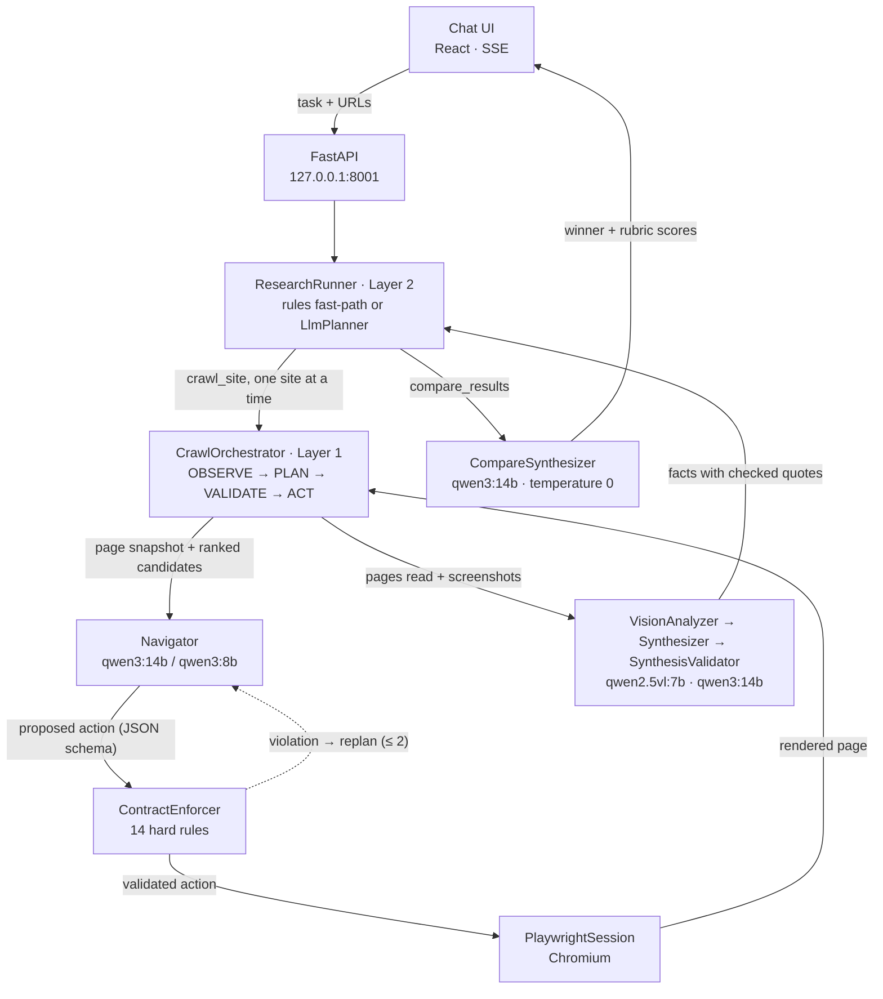

# Local Web Agent

**A web research agent that runs entirely on your machine.** Give it URLs and a task in plain language: it browses each site in a real browser, acts on pages under a behavioral contract enforced in code, and backs its answer with quotes checked against the pages it actually read.

**Local models only (Ollama)**<!-- src: backend/app/config.py:21-26,66; knowledge/product/overview.md:32-34 --> · **451 tests**<!-- src: cd backend && .venv/bin/pytest (collect-only, -q) → "451 tests collected" = 443 at ba008dd + 8 in backend/tests/test_tier3_checkout_fixtures.py --> · **14 hard contract rules**<!-- src: data/contracts/crawl.contract.yaml:23-61 (9 invariants) + 70-90 (5 limits) --> · **31 git-hook gates**<!-- src: .pre-commit-config.yaml, 31 hooks = 25 pre-commit + 6 pre-push (counted with yaml.safe_load) --> · **23 design docs**<!-- src: ls docs/[0-9]*.md | wc -l → 23 --> · **21 archived delivery slices**<!-- src: delivery/archive/INDEX.md:22-42 -->

Status: design phases 0–7 are complete; current work is hardening on real websites.<!-- src: docs/README.md:7,44-52 -->

## What it does

- **Researches sites from a plain-language task.** Paste one or more URLs and say what you need. For each site the agent opens pages in a real browser, decides where to go next, and returns a summary, facts with verbatim quotes and an explicit list of what it could not find, in the language you asked in (recorded runs in English, Russian and German).<!-- src: backend/app/schemas/extraction.py:78-92; DEMO.md:57-67; knowledge/engineering/llm-canon.md:83-85 -->
- **Compares sites.** Research Chat crawls up to 10 sites<!-- src: backend/app/config.py:85 --> one after another and scores them against a rubric (content completeness, design differences or a generic merge), naming a winner and the reasons.<!-- src: backend/app/research/meta_agent.py:70-74,111-121; data/prompts/rubrics/ -->
- **Acts on pages, up to the irreversible click.** It opens tabs and "show more" on its own, fills a whole form in one decision, submits only after you confirm, and never presses *buy / pay / delete / publish*: it prepares everything and hands that button to you in the visible browser. Logins and "are you a robot" checks are yours too; bypassing them is out of scope for good.<!-- src: knowledge/engineering/action-tiers.md:27-35; knowledge/engineering/no-anti-bot-bypass.md:18-32 -->
- **Uses vision when the DOM is not enough.** For design audits and pages whose content never reaches the DOM, desktop screenshots go to a local vision model; facts it only *saw* are labeled `source: vision` and never count as high-confidence.<!-- src: backend/app/research/meta_agent.py:53-58; backend/app/orchestrator/capture.py:32-44; backend/app/extraction/synthesis_validator.py:105-117 -->
- **Hands results over** as a Markdown file in the session or, only on explicit request, as a Google Doc: the single path that leaves the machine.<!-- src: backend/app/sinks/file.py:1-5; delivery/CONSTITUTION.md:14-16 -->

> **A real session.** Task: *"Find an article that explains how to bake bread at home, and compare which site covers the topic more thoroughly"*, three baking sites. Scores: King Arthur Baking **95** (winner), BBC Good Food **75**, food52 **10**.<!-- src: docs/26-real-site-trials.md:1047-1049 (task, verbatim), 1062-1066 (scores) --> On food52 the agent never reached the guide, and its answer said reading was cut short by its own limits instead of claiming the site has no such article.<!-- src: docs/26-real-site-trials.md:1073-1077 -->

## Why it's hard, and what's different

- **No selectors, no per-site rules.** The model reads a compact snapshot of the rendered page (title, headings, text, links ranked by code, numbered form controls) and points at elements by index, not by brittle CSS selectors.<!-- src: data/prompts/navigator_user.j2; backend/app/schemas/snapshot.py:33-38 --> "Don't build logic for a specific site" is a written project rule; per-vertical keyword lists were deleted once a measurement showed a general rule did the job.<!-- src: delivery/active/spec.md:59; delivery/active/plan.md:29; docs/README.md:110 -->
- **The model proposes, a contract decides.** Every proposed action passes `ContractEnforcer` before Playwright sees it: 14 hard rules on where the agent may go, what it may touch and how much it may do.<!-- src: backend/app/contracts/enforcer.py:1-4 --> A violation goes back to the model for a replan (at most 2 per step), then code falls back to the top-ranked link. Repeated violations tighten the run by themselves: lower temperature, top-5 candidates only, finally deterministic navigation.<!-- src: data/contracts/crawl.contract.yaml:92-94; backend/app/orchestrator/decide.py:23-26,77-135,160-164 -->
- **Answers you can check, and reproduce.** A high-confidence fact needs a quote that is actually found on a page the agent read (fuzzy match ≥ 0.85); a quote that isn't found is dropped, and a fact left without one becomes `not_found`.<!-- src: data/contracts/synthesis.contract.yaml:15-20; backend/app/extraction/synthesis_validator.py:73-88 --> Site comparisons run at temperature 0: at 0.2 two runs on identical inputs scored 90/80/60 and 82/78/65, at 0.0 they matched bit for bit.<!-- src: backend/app/config.py:47-52; backend/tests/test_compare_determinism.py --> When the model obeyed a prompt rule ("don't call an unread page absent") on only one site of two, that guarantee moved into code.<!-- src: knowledge/engineering/llm-canon.md:94-104; backend/app/orchestrator/synthesize.py:87-99 -->

## Architecture


<!-- src: backend/app/main.py:56-83 (wiring); backend/app/orchestrator/states.py:8-16; backend/app/config.py:16-17,22-26,52,66; backend/app/research/llm_planner.py:67-72 -->

1. **Plan (Layer 2).** `ResearchRunner` turns a chat message into tool calls. A message with URLs is planned by code: URLs + intent keywords → N × `crawl_site` → `compare_results`. A follow-up without URLs goes to `LlmPlanner`, whose plan may only use the 6 registered actions; a URL the user never gave is dropped.<!-- src: backend/app/research/meta_agent.py:111-121; docs/24-research-chat-agent.md:104-109; backend/app/research/actions/ (6 register calls) -->
2. **Walk (Layer 1).** Each site gets a `CrawlOrchestrator` run: a state machine whose page budget (default 10) and hop depth (default 3) are enforced by code, not by the model.<!-- src: backend/app/orchestrator/states.py:8-16; backend/app/config.py:73,78; data/contracts/crawl.contract.yaml:71-78 -->
3. **Decide.** Code builds and ranks the candidates (page links, slug probes, sitemap); `Navigator` picks one action. The light `qwen3:8b` takes decisions local to the current page, `qwen3:14b` chooses by meaning and handles every replan.<!-- src: data/contracts/crawl.contract.yaml:27; backend/app/llm/model_router.py:3-12,35-60 -->
4. **Answer.** The browser closes; if vision is needed, screenshots go to `qwen2.5vl:7b` (at most 12 calls per run). `Synthesizer` writes an `ExtractionResult`, and `SynthesisValidator` checks every quote against the pages read.<!-- src: data/contracts/vision.contract.yaml:8-11,31-33; backend/app/orchestrator/loop.py:117-134 -->
5. **Compare.** `CompareSynthesizer` scores the sites against a rubric from `data/prompts/rubrics/` at temperature 0. Progress streams to the UI over SSE, runs and sessions live in SQLite, and only one 14B model is in memory at a time.<!-- src: backend/app/research/compare_synthesizer.py:70-123; backend/app/api/sse.py:67; backend/app/storage/sqlite_store.py:72; knowledge/engineering/llm-canon.md:58-59 -->

## Behavioral contract

The crawl contract follows *Agent Behavioral Contracts* ([Bhardwaj, arXiv:2602.22302](https://arxiv.org/abs/2602.22302)): preconditions, invariants, governance limits and recovery, declared in YAML. It is data, not code: the loader accepts only named checks and refuses to start on an unknown one.<!-- src: docs/13-behavioral-contracts.md:4-5; backend/app/contracts/loader.py:1-4,47-48; backend/app/main.py:41 --> Its 14 hard rules are 9 invariants plus 5 limits:<!-- src: data/contracts/crawl.contract.yaml:23-61, 70-90 -->

| Guards | Rules |
|---|---|
| **Where it may go** | same site (I-H1) · only URLs from the code-built candidate queue, no invented links (I-H6) · no private-network targets from a public site, an SSRF guard (I-H8) · domain re-checked after every redirect (I-H9) · no revisits, redirect aliases included (G-H3) |
| **What it may touch** | no autonomous submit (I-H2) · clicks only on safe, non-submit elements (I-H10) · typing only into text fields, never `password` (I-H11) · irreversible buttons go to a human (I-H12) |
| **How much** | page budget (G-H1) · hop depth (G-H2) · at least 1 s between requests to public hosts (G-H4)<!-- src: data/contracts/crawl.contract.yaml:82-86 (min_delay 1000, private hosts exempt) --> · robots.txt (G-H5) · 30 s page-timeout ceiling (G-H6)<!-- src: data/contracts/crawl.contract.yaml:87-90 (max 30000) --> |

Two of them (excerpt, comments translated):

```yaml
- id: no_private_network     # SSRF guard
  code: I-H8
  check: public_http_url
  forbidden: [loopback, rfc1918, link_local, dot_local]
  override_flag: allow_private
- id: click_destructive_handoff  # I-H12 (doc 25, Tier 3): the agent never presses an irreversible button
  code: I-H12                    # unattended → reject; attended → handoff (the human presses it)
  check: click_not_destructive
  destructive_signals: [buy, pay, purchase, checkout, "place order", "submit order",
                        "order now", delete, remove, publish, "post now",
                        оплат, купи, покупк, заказ, удал, опубликов]
```
<!-- src: data/contracts/crawl.contract.yaml:31-35, 45-50 -->

Answers and screenshots have contracts of their own: `synthesis.contract.yaml` (a quote must be found on a page that was read, at most 20 facts, "not found" beats an empty guess) and `vision.contract.yaml` (screenshot path allow-list, no path traversal, 5 MB per image, at most 12 model calls).<!-- src: data/contracts/synthesis.contract.yaml:15-30; data/contracts/vision.contract.yaml:15-36 -->

## How it's engineered

Specified before it is built, measured before it is changed, and "done" only when a machine-checked gate says so.<!-- src: docs/18-engineering-standards.md:7; delivery/active/STATUS.md:44; delivery/CONSTITUTION.md:12,25 -->

**Agent-built, human-verified.** Code is written by a coding agent inside this harness and accepted by a human: every one of the 21 archived slices records `builder: agent:claude-code`, `verifier: human:anthony`.<!-- src: git grep "builder:\|verifier:" in delivery/archive/*/STATUS.md → 21 + 21 --> Agent hooks block force-pushes to `main` and keep the agent from ending a turn while the fast gates are red. The standing rule: an agent mistake is answered with a stronger oracle, breaker or hook, not only a better prompt.<!-- src: .claude/settings.json:3-23; scripts/hooks/protect_main.py:1-9; scripts/hooks/stop_on_red.sh:2; delivery/CONSTITUTION.md:26-27 -->

**Delivery slices.** Work ships in slices under `delivery/`. A small slice carries a task list; a class M/L slice adds a spec with acceptance examples and a plan with rejected alternatives, signed off by a human before implementation; each slice closes against oracles, never on self-declaration. The archive holds 21 slices, 18 verify reports and 6 spec + plan pairs.<!-- src: delivery/CONSTITUTION.md:23-26,36; git ls-files delivery/archive | grep -v -e INDEX.md -e .gitkeep | cut -d/ -f3 | sort -u | wc -l → 21; git ls-files delivery/archive | grep -c '/verify-report.md$' → 18; grep -ci '/spec.md$' → 6, '/plan.md$' → 6 --> Acceptance criteria for a live run are written before the run, e.g. "zero repeat visits to one URL".<!-- src: delivery/active/STATUS.md:83-99; docs/26-real-site-trials.md:24-26 -->

**Decisions carry their evidence.** 16 architecture decisions (D-1 … D-14) are closed and recorded, several with the benchmark that closed them, and the design docs hold 260 dated changelog entries, because a design change means a doc edit, a changelog entry and a version bump.<!-- src: docs/README.md:5,73-90 (sed -n '73,90p' docs/README.md | grep -c '^| \**D-' → 16); changelog rows: awk '/^##+ Changelog/{f=1;next} /^#+ /{f=0} f && /^\| *\**20[0-9][0-9]-/' docs/*.md | wc -l → 260 --> Plans record what was rejected and by which number. One example, translated:

> **Chose** to keep the article excerpt at 8,000 characters, exactly what a page snapshot stores, **over** raising it to 12,000, **because** the three-site comparison block would grow to ~13,450 tokens (Russian text) and, with the 4,096-token answer, reach 17,546 tokens against a 16,384-token context window.<!-- src: delivery/active/plan.md:25; backend/app/observer/snapshot.py:94; knowledge/engineering/llm-canon.md:132-141 -->

**Quality gates.** 31 git hooks, 25 on commit and 6 on push: ruff and ruff-format, mypy `strict` with zero overrides, ESLint and Prettier, import-linter (3 layer contracts), a secrets scan, file-length and complexity limits, and project rules checked by AST or grep: prompts may not live inline in Python, errors may not be swallowed silently, list endpoints must be bounded.<!-- src: .pre-commit-config.yaml (hook ids inline-prompt-gate, silent-except-gate, unbounded-list-gate, import-linter, detect-secrets …); backend/pyproject.toml:42-45,78-79; backend/.importlinter:19-75 --> 14 baselines may only shrink.<!-- src: git ls-files 'scripts/lint/*baseline*.txt' | wc -l → 14; .pre-commit-config.yaml:257-261 --> CI re-runs the commit-stage hooks on every PR, plus the baseline ratchet, diff coverage ≥ 70 %, the delivery phase gate, a code↔knowledge sync gate and the smoke suite.<!-- src: .github/workflows/quality.yml:42-126 (pre-commit run all-files executes commit-stage hooks only; MIN_PCT 70 at :64) -->

**The gates are tested too.** `scripts/lint/contour_doctor.py` proves each gate by execution: it plants a *canary*, a known violation of exactly the class the gate guards, and demands "green without it, red with it". A gate that stays silent on its canary is reported DEAD. A run on 2026-09-26: 34 checks proven by execution and 0 DEAD, plus 10 WEAK, 6 ABSENT and 3 TOOL, each with a named reason.<!-- src: scripts/lint/contour_doctor.py:1-25; scripts/lint/doctor_core.py:17-22; run 2026-09-26, python3 scripts/lint/contour_doctor.py: "AUTO 34 · WEAK 10 · ABSENT 6 · TOOL 3 · SKIP 0 · DEAD 0" --> The process tooling has 54 tests of its own.<!-- src: pytest (collect-only) on tests/test_delivery_check_gate.py, test_gate_scripts.py, test_protect_main_hook.py, test_lint_contour.py → 54 -->

**Tests.** 451 tests, and the suite needs neither a model nor a network: a fake browser, a scripted model, fixture HTML read from disk.<!-- src: pytest (collect-only) → 451; backend/tests/conftest.py:1,21-39,68-174; delivery/evals/smoke/README.md:3-5 -->

- *Behavior tests* for the orchestrator, contracts and research layer, most of the recent ones written from a real failure in a live run.<!-- src: DEMO.md:129-130 -->
- *Fixture-markup tests* read the real HTML of the local test sites: the English checkout must mirror the Russian one element by element, irreversibility marks included.<!-- src: backend/tests/test_tier3_checkout_fixtures.py:1-12,160-172 -->
- *Cassettes keyed by prompt hash:* a recorded model reply is looked up by the SHA-256 of model + system + user prompt, so editing a prompt fails the test loudly and names the changed prompt file. A corruption probe measures the coverage: 8 of 19 prompt files are guarded; the other 11 sit in a baseline that may only shrink.<!-- src: backend/tests/cassettes.py:1-15,48-55,116-133; scripts/lint/prompt_coverage_baseline.txt:1-4 -->
- *Smoke oracles*, 5 of them: full suite, the 500-line module limit, API `/health`, frontend build, fixture server.<!-- src: delivery/evals/smoke/README.md:7-13 -->

**Measured, not assumed.** Model and budget choices cite measurements. The light `qwen3:8b` made the same page-local decisions as `qwen3:14b` in 9.4 s instead of 16.8 s, but failed 3 of 3 runs when it had to pick an article by meaning, so it only gets page-local decisions.<!-- src: backend/app/llm/model_router.py:3-12 --> Development ran on real sites, not just fixtures: the local run log holds 143 runs and 932 steps, 73 of those runs on 27 real websites.<!-- src: local run DB data/runs/app.db (gitignored, NOT in the repo); counted 2026-09-26 read-only: crawl_runs 143, crawl_steps 932, runs whose start_url host is not loopback/private 73, on 27 distinct hosts --> Every live trial, misses included, is logged in [doc 26](docs/26-real-site-trials.md).

## Quickstart

**Prerequisites**

- macOS on Apple Silicon. Everything here was developed and measured on a MacBook Air M5 with 32 GB RAM; CI runs the tests and gates on Ubuntu, but model runs on Linux are untested.<!-- src: knowledge/product/overview.md:15-16; .github/workflows/quality.yml:17 -->
- Python ≥ 3.12 with [uv](https://docs.astral.sh/uv/), Node.js 22, [Ollama](https://ollama.com).<!-- src: backend/pyproject.toml:5; knowledge/ops/local-run.md:37; .github/workflows/quality.yml:24-28 -->
- The three models set in `backend/app/config.py`:

```bash
ollama pull qwen3:14b      # navigation, synthesis, comparison
ollama pull qwen3:8b       # light model for page-local decisions
ollama pull qwen2.5vl:7b   # vision
```
<!-- src: backend/app/config.py:22,25,26,66 -->

**Install and run**

```bash
git clone https://github.com/AnthonyPriceOne2691/local-web-agent.git && cd local-web-agent

cd backend && uv sync --extra dev                 # add --extra gdocs for the Google Docs export
.venv/bin/playwright install chromium
cd ../frontend && npm install && npm run build    # the API serves the built UI at /
cd ..

ollama serve &                                    # if the daemon isn't running
cd backend && .venv/bin/python -m uvicorn app.main:app --host 127.0.0.1 --port 8001
```
<!-- src: knowledge/ops/local-run.md:36-49; DEMO.md:34-47; docs/07-tech-stack.md:198 (playwright install) --><!-- checked 2026-09-26 in a fresh worktree: uv sync, npm ci and build, uvicorn start, /health answers -->

Open **http://127.0.0.1:8001/**. `curl -s http://127.0.0.1:8001/health` should report `"ollama": "reachable"` and `qwen3:14b` present.<!-- src: DEMO.md:46,49; backend/app/api/routes_health.py:12-24 --> Every setting is an env var with the `LWA_` prefix, e.g. `LWA_MAX_DEPTH`.<!-- src: backend/app/config.py:1,13 --> For UI work, `npm run dev` in `frontend/` starts Vite on :5173 and proxies the API.<!-- src: frontend/vite.config.ts:5-16; knowledge/ops/local-run.md:25 -->

**Try it on the bundled fixture sites** (plain local HTML with no external resources):

```bash
backend/.venv/bin/python scripts/spike/fixtures_server.py    # nine sites on 127.0.0.1:8901–8909
```
<!-- src: scripts/spike/fixtures_server.py:23-25,51-53; DEMO.md:39-40; ls tests/fixtures/sites → 9 dirs; grep finds no external src/href in them -->

- Send *"Find an article about football betting and summarize the main points: http://127.0.0.1:8901/"* in the chat. A full cycle took about 3 minutes on the reference machine.<!-- src: DEMO.md:90-97, rehearsed with the Russian wording of this task: 3 min 09 s, 2 pages read -->
- Tick **Show me the browser**, then send *"Order the WX-9 widget: fill in name, email and address, and take it through to payment: http://127.0.0.1:8909/"*. The agent fills the form and stops at the pay button for you to press: contract rule I-H12 forbids that click without a human, and the tests pin it on this very page.<!-- src: DEMO.md:82-84,110; data/contracts/crawl.contract.yaml:45-50; backend/tests/test_tier3_checkout_fixtures.py:176-214; a live run with a human pressing the button is recorded for the Russian original on :8908, docs/README.md:51 -->

**CLI and tests**

```bash
backend/.venv/bin/python -m cli.main research --task "Find the most complete article about football betting" \
  --urls http://127.0.0.1:8901/,http://127.0.0.1:8902/
(cd backend && .venv/bin/python -m pytest -q)     # 451 tests, no model, no network
bash delivery/evals/smoke/run.sh                  # 5 smoke oracles
```
<!-- src: cli/main.py:1-7,188-200; delivery/evals/smoke/README.md:9; delivery/evals/smoke/run.sh --><!-- checked 2026-09-26: the CLI help runs from the repo root with the backend venv -->

## Documentation map

The numbered design docs in [`docs/`](docs/README.md) are written in Russian; numbers 08–11 are unused.<!-- src: docs/README.md:37 --> Each has a version header and a changelog.

| Doc | Topic |
|---|---|
| [00](docs/00-project-overview.md) | Project overview: goals, the two-layer idea |
| [01](docs/01-requirements.md) | Requirements: functional and non-functional, action tiers, SSRF, cancel |
| [02](docs/02-architecture.md) | Architecture: Layer 1 and Layer 2 components |
| [03](docs/03-browser-pipeline.md) | Browser pipeline: load, wait, observe; refusal and empty pages are not content |
| [04](docs/04-crawl-orchestrator.md) | Crawl orchestrator: the agent loop as a state machine, hop depth |
| [05](docs/05-extraction-schema.md) | Extraction schema: `ExtractionResult`, `ComparisonResult`, evidence |
| [06](docs/06-mvp-phases.md) | MVP phases 0–7 with exit criteria, then the improvement backlog |
| [07](docs/07-tech-stack.md) | Tech stack and LLM settings |
| [12](docs/12-session-storage.md) | Session storage: SQLite runs and research sessions |
| [13](docs/13-behavioral-contracts.md) | Behavioral contracts: ABC-lite, hard and soft rules, recovery, drift |
| [14](docs/14-llm-model-split.md) | LLM model split: which model decides what, and the fallbacks |
| [15](docs/15-api-cli-spec.md) | API and CLI spec: REST, SSE events, attended resume |
| [16](docs/16-prompts-library.md) | Prompt library: structured outputs, `think`, model routing, answer language |
| [17](docs/17-ui-screens.md) | UI screens: CLI flows and the chat UI |
| [18](docs/18-engineering-standards.md) | Engineering standards: 500-line modules, SOLID, DRY, coverage |
| [19](docs/19-phase0-benchmark-results.md) | Phase 0 benchmark: the measurements behind the model choice |
| [20](docs/20-context-token-budget.md) | Context and token budget: snapshot caps, non-Latin text, comparing more than 3 sites |
| [21](docs/21-navigation-hints.md) | Navigation hints: deterministic candidate ranking, slugs, sitemap, topic over form |
| [22](docs/22-page-screenshots.md) | Page screenshots and cookie-banner handling |
| [23](docs/23-vision-analysis.md) | Vision analysis: screenshot to local VLM, failure modes |
| [24](docs/24-research-chat-agent.md) | Research Chat agent: Layer 2 sessions, planner, compare, attended mode |
| [25](docs/25-action-framework.md) | Action framework: Tier 0 exports · Tier 1 click · Tier 2 fill/submit · Tier 3 human handoff |
| [26](docs/26-real-site-trials.md) | Real-site trials: protocol and a journal of live runs, misses included |

Also worth opening: `data/contracts/` (the contracts), `data/prompts/` (all 19 prompt files; a gate keeps prompts out of code), `knowledge/` (the invariants canon; 6 notes are bound to code paths, and a gate fails when those paths change without the note), `delivery/` (constitution, active slice, archive) and [`DEMO.md`](DEMO.md) (demo script with measured timings, in Russian).<!-- src: git ls-files data/prompts | wc -l → 19; .pre-commit-config.yaml inline-prompt-gate; implementation: lists in knowledge/**/*.md → 6 files; AGENTS.md:32-35 -->

## Limitations

- **Slow on real sites.** One real site took 7 min 38 s end to end on the reference machine, and only 97 s of that was the model; the rest was network, because a VPN tunnel there stalls Chromium for 16–30 s on about a third of page loads. A local fixture site takes about 3 minutes, three fixture sites plus a comparison about 10. It is a background research tool, not an instant one.<!-- src: DEMO.md:7-8,15-21,25-26; docs/26-real-site-trials.md:760-777 -->
- **Measured on one machine.** All timings come from a MacBook Air M5 with 32 GB; other hardware is untested.<!-- src: knowledge/product/overview.md:15-16 -->
- **Sequential by design.** One crawl at a time (a second one gets `409`), sites one after another.<!-- src: docs/README.md:83,88 -->
- **Real-site navigation is the weak spot.** The trial journal shows it plainly: 0 of 3 articles found in two runs before later navigation fixes, and the food52 miss above.<!-- src: docs/26-real-site-trials.md:819,821,1073-1077 -->
- **Prompt protection is partial.** Cassettes pin 8 of 19 prompt files; the navigator, synthesis, compare and vision prompts are not pinned yet.<!-- src: scripts/lint/prompt_coverage_baseline.txt:4-15 -->
- **Russian docs, external canons.** Design docs and most code comments are in Russian; identifiers, prompts and the UI are in English. The process canons that `delivery/` cites by version (delivery@1.80 · cqg@2.22 · okf@1.17) live outside this repo; what is here is their deployed form: configs, scripts and the records they produce.<!-- src: data/prompts/navigator_system.txt:1; delivery/CONSTITUTION.md:5-7; delivery/STACK-ACCEPTANCE.md:4-7 -->

## License

[MIT](LICENSE).

---

Built by **Anton Aspidov**, AI / full-stack product engineer. More work: [portfolio-site.anthony-priceone.workers.dev](https://portfolio-site.anthony-priceone.workers.dev)
